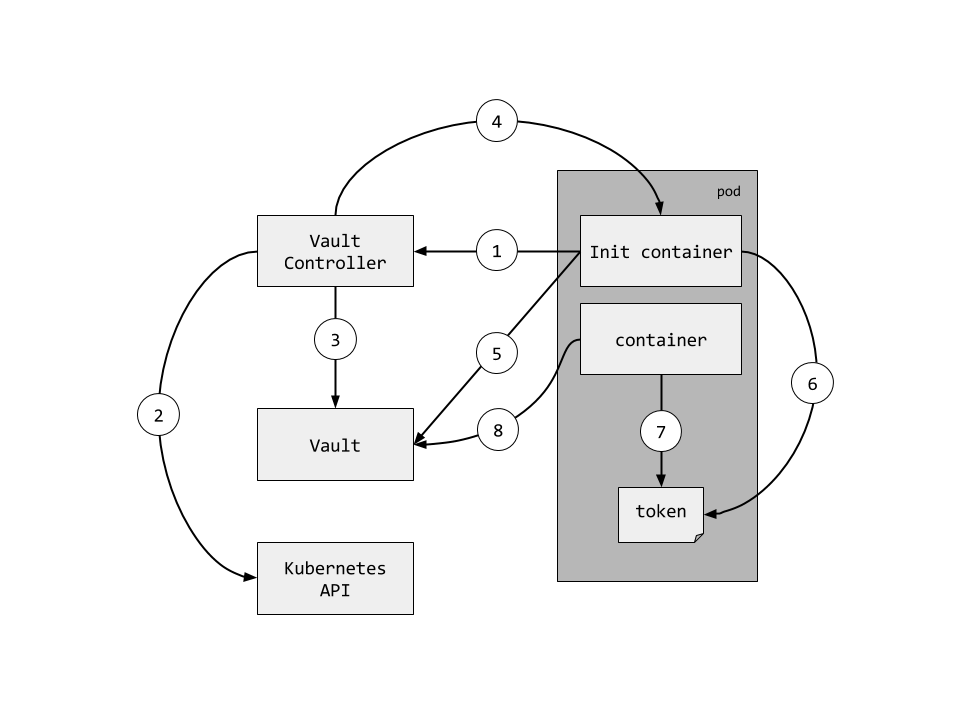

# Vault Controller

The Vault Controller automates the creation of Vault tokens for Kubernetes Pods. This repo includes a set of [hands-on tutorials](#usage) and example programs you can use to try out the Vault Controller.

## Status

This is a prototype. Do not use this in production.

## Use Case

* Each Pod requires a dedicated Vault token tied to the Pod's life-cycle
* Each Pod will use a dedicated Vault token to request secrets from a Vault server

## Documentation

### How it Works



1. An Init container requests a wrapped token from the Vault Controller
2. The Vault Controller retrieves the Pod details from the Kubernetes API server
3. If the Pod exists and contains the `vaultproject.io/policies` annotation a unique wrapped token is generated for the Pod.
4. The Vault Controller "callsback" the Pod using the Pod IP obtained from the Kubernetes API.
5. The Init container unwraps the token to obtain a dedicated Vault token.
6. The dedicated token is written to a well-known location and the Init container exits.
7. Another container in the Pod reads the token from the token file.
8. Another container in the Pod renews the token to keep it from expiring.

More details can be found in the [How it Works](docs/how-it-works.md) document.

## Usage

The following tutorials will guide you through the deployment of the `vault-controller` and an example application to see how it all works.

### Prerequisites

Clone this repository:

```
git clone https://github.com/kelseyhightower/vault-controller.git
```

```
cd vault-controller
```

Before you can complete the tutorials you'll need access to a Kubernetes clusters. [Google Container Engine (GKE)](https://cloud.google.com/container-engine/) or [minikube](https://github.com/kubernetes/minikube) should work.

### Tutorials

* [Deployment Guide](docs/deployment-guide.md)
* [Example Usage](docs/example-usage.md)
* [Use Case: Short-lived TLS Certs, TLS Mutual Auth, and Microservices](docs/microservice-tutorial.md)

## Cleanup

Once you are done with the tutorials run the following command to clean up:

```
kubectl delete namespace vault-controller
```
